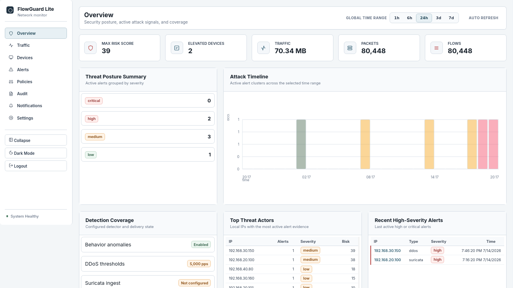

# FlowGuard Lite

[](https://github.com/miquelbar/flowguard-lite/actions/workflows/ci.yml)
[](https://github.com/miquelbar/flowguard-lite/actions/workflows/deploy-docs.yml)
[](https://github.com/miquelbar/flowguard-lite/pkgs/container/flowguard-lite)
[](LICENSE)

FlowGuard Lite is experimental alpha software, primarily tested on one UniFi home network.

> [!WARNING]
> *   FlowGuard Lite is an early-stage project and **may contain bugs**.
> *   All security detections are **experimental heuristics**, not guaranteed indicators of compromise.
> *   It **does not replace an IDS, SIEM, or SOC**, and should not be considered a guarantee of attack detection.
> *   Additional integrations (sFlow, syslog, passive capture, DuckDB, Suricata, DDoS, notifications) have varying and limited levels of validation.

It stores flow data locally, groups activity by device, and experiments with detecting changes from normal behaviour.

This experimental alpha project has primarily been tested on one UniFi home network. Several additional collectors and integrations are implemented, but some still need broader real-world validation.

## Try It

Published multi-arch images are available on GitHub Container Registry:

```bash
docker pull ghcr.io/miquelbar/flowguard-lite:edge
```

Minimal Docker Compose deployment:

```yaml
services:
  flowguard:
    image: ghcr.io/miquelbar/flowguard-lite:edge
    container_name: flowguard
    restart: unless-stopped
    ports:
      - "8080:8080"        # Web UI and REST API
      - "2055:2055/udp"    # NetFlow v5/v9 and IPFIX
      - "6343:6343/udp"    # sFlow
      - "514:5514/udp"     # UniFi SIEM/syslog host port mapping
    volumes:
      - flowguard_data:/data

volumes:
  flowguard_data:
```

Then open:

```text
http://localhost:8080
```

## Visual Preview



The seeded console includes populated Overview, Traffic, Devices, Alerts, Policies, Notifications, Audit, and Settings views so reviewers are not greeted by empty tables.

## Why Use It

Small networks often have capable routers and firewalls but poor visibility into device behavior. FlowGuard Lite focuses on:

- **Device-level explanations:** every anomaly explains what happened, why it is unusual, the baseline used, and the next check.
- **Practical collectors:** NetFlow/IPFIX, UniFi SIEM/syslog, passive capture, and optional Suricata evidence.
- **Small hardware:** designed for Intel N100-class boxes and bounded local storage.
- **Noise controls:** suppress noisy detector types, subnets, or notification targets without losing all evidence.
- **Simple deployment:** one Docker container, SQLite daily shards by default, no external data platform.
- **Operator workflow:** alerts, devices, policies, notifications, audit logs, Telegram/webhook tests, and configuration backup from the UI.

FlowGuard Lite is alert-only. It can generate firewall rule templates, but it does not automatically block traffic.

## Feature Validation Status

The features in this repository are divided into three validation tiers:

| Category | Features Included |
| --- | --- |
| **Tested in real use by the author** | * **NetFlow/IPFIX Ingestion** (from UniFi Gateway)<br>* **Docker Compose Deployment**<br>* **SQLite daily shards** (storage & retention)<br>* **Home network environment** |
| **Implemented with limited validation** | * **sFlow Ingestion** (collector listener & decoder)<br>* **Passive Network Capture** (via SPAN/Mirror port)<br>* **Suricata IDS Integration** (correlating `eve.json` records)<br>* **DuckDB Storage Engine** (for query acceleration)<br>* **DDoS/Volumetric Heuristics** (BPS, PPS, FPS thresholds)<br>* **Slack & Telegram Webhook notifications** |
| **Experimental or unverified** | * **UniFi Syslog/SIEM Ingest** (highly experimental and secondary; note that NetFlow/IPFIX is the primary and best tested source)<br>* **SNMP Auxiliary Metrics** (future/optional tracking only) |

## Documentation

- [Documentation site](https://miquelbar.github.io/flowguard-lite/)
- [Installation Guide](docs/installation.md)
- [Configuration Reference](docs/configuration.md)
- [Capacity & Performance Guide](docs/capacity-guide.md)
- [Exporter Setup: UniFi](docs/setup/unifi.md)
- [Integrations and Webhooks](docs/features/integrations.md)

## Performance & Capacity Estimates

FlowGuard Lite includes a synthetic benchmark suite. Measured metrics and capacity estimates are based on synthetic microbenchmarks run under controlled environments (e.g., a 1 CPU Core, 2 GB RAM Docker container).

Actual capacity and system resource consumption depend on:
- Number of active flows and telemetry packets per second
- Configured exporter sampling rate
- Active IP cardinality and internal vs. external destinations
- Configured retention window and aggregate flush frequency
- Host processor, disk I/O, and file system throughput
- Number of active collectors

For preliminary capacity estimations and performance specs, please refer to the [Capacity & Performance Guide](docs/capacity-guide.md) and [Performance Baselines](docs/performance-baselines.md).

## Local Development

```bash
make setup
make docker-build
make docker-up
```

Export the built image for offline installs:

```bash
make docker-export
docker load -i dist/flowguard-image.tar
```

For local demo data:

```bash
cp config.example.yaml config-dev.yaml
go run ./cmd/flowguard -config config-dev.yaml -seed
go run ./cmd/flowguard -config config-dev.yaml
```

Then open `http://localhost:8080`.

## Quality Gates

Run the backend Go package tests:

```bash
make test
```

Run formatting and vet checks:

```bash
make lint
```

Run frontend build/lint and Cypress smoke regression tests in Docker:

```bash
make docker-ui-test
make docker-ui-smoke
```

Run the full pre-release gate:

```bash
make pre-release-gate
```

The pre-release gate runs backend Go tests, Dockerized Vite build/lint, Cypress smoke/workflow tests, the benchmark smoke test, and whitespace checks.

## Benchmarks

Run the lightweight performance regression smoke test:

```bash
make benchmark-smoke
```

Run local benchmark reports:

```bash
make benchmark-run
```

Run containerized benchmark profiles:

```bash
make docker-benchmark-run
make benchmark-matrix
```

Benchmark reports are written under `benchmark-results/`, which is intentionally ignored by Git.

## Deployment Notes

- Do not expose FlowGuard Lite directly to the public internet.
- Use HTTPS, a reverse proxy, VPN, or firewall restrictions for remote access.
- Keep notification tokens, webhook headers, and session secrets out of logs and public config.
- Retention must stay bounded; FlowGuard Lite does not store raw flows or raw Suricata/UniFi logs indefinitely.
- Passive capture is opt-in and should use narrow Linux capabilities, not `privileged: true`.

## Project Status

Experimental alpha. Primarily tested on one UniFi home network. External testing and feedback are needed. The core flow collection, storage, baseline heuristics, operator UI, and notification channels are implemented as prototypes, but require broader real-world validation.
